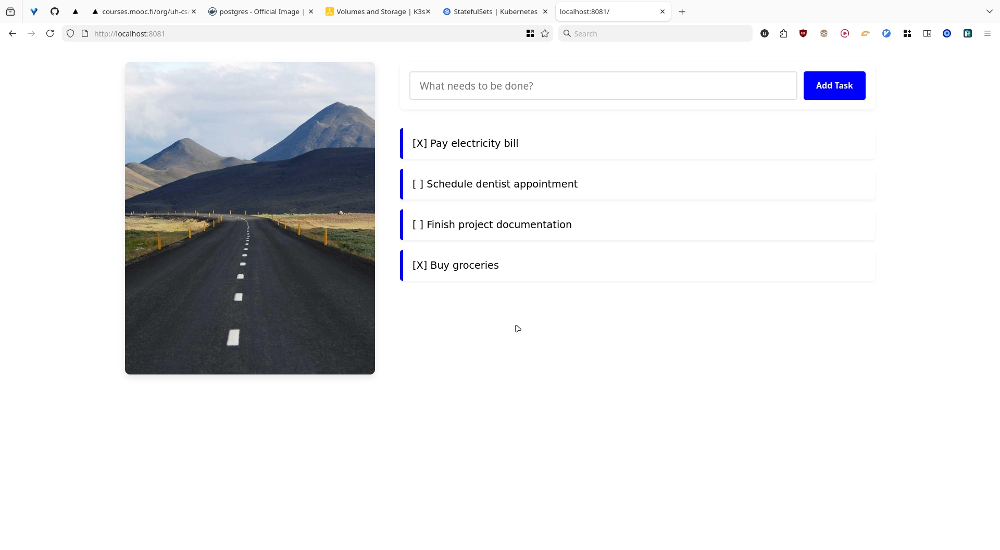

**Using Namespace: project**

### Architecture
The `todo-frontend` and `todo-backend` are managed as **Deployments**,
while `postgres-todo-stset` is a **StatefulSet** utilized by the
backend for persistent data storage.

